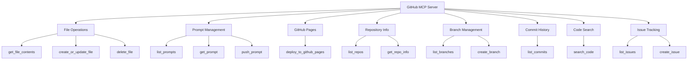

# GitHub MCP Server

A [Model Context Protocol (MCP)](https://modelcontextprotocol.io/) server built with
[fastmcp](https://github.com/jlowin/fastmcp) that exposes GitHub operations as MCP
tools. Use it to let an offline LLM (or any MCP-compatible client such as
**GitHub Copilot**) read and write files, manage prompts, deploy GitHub Pages, and
perform common repository operations — all through natural language.

---

## ✨ Features at a glance

| Category | Tools |
|---|---|
| **File I/O** | `get_file_contents`, `create_or_update_file`, `delete_file` |
| **Prompt management** | `list_prompts`, `get_prompt`, `push_prompt` |
| **GitHub Pages** | `deploy_to_github_pages` |
| **Repository info** | `list_repos`, `get_repo_info` |
| **Branches** | `list_branches`, `create_branch` |
| **Commits** | `list_commits` |
| **Code search** | `search_code` |
| **Issues** | `list_issues`, `create_issue` |

---

## 🗺️ Tool map



---

## 🚀 Quick start

### 1. Clone the repository

```bash
git clone https://github.com/<your-username>/github-mcp-server.git
cd github-mcp-server
```

### 2. Install dependencies

```bash
pip install -r requirements.txt
```

### 3. Set your GitHub token

Create a [Personal Access Token](https://github.com/settings/tokens) with the
scopes you need (typically `repo` and `read:user`) and export it:

```bash
export GITHUB_TOKEN="ghp_xxxxxxxxxxxx"
```

Alternatively, create a `.env` file in the project root:

```
GITHUB_TOKEN=ghp_xxxxxxxxxxxx
```

### 4. Run the server

```bash
python server.py
```

---

## 🔌 Loading into GitHub Copilot

Copy the `mcp.json` file from this repository to your workspace (or user-level MCP
config directory), then replace the placeholder token:

```json
{
  "mcpServers": {
    "github-mcp-server": {
      "command": "python",
      "args": ["server.py"],
      "env": {
        "GITHUB_TOKEN": "<your-github-personal-access-token>"
      }
    }
  }
}
```

> **Tip:** In VS Code with the Copilot extension, place this file at
> `.vscode/mcp.json` inside your workspace, or at
> `~/.config/github-copilot/mcp.json` for a user-wide configuration.

---

## 🔧 Tool reference

### File operations

#### `get_file_contents`
Return the text content of a file (or a directory listing if the path is a
directory).

| Argument | Type | Default | Description |
|---|---|---|---|
| `owner` | str | required | Repository owner |
| `repo` | str | required | Repository name |
| `path` | str | required | File path inside the repo |
| `ref` | str | `"main"` | Branch, tag, or commit SHA |
| `token` | str | env var | GitHub PAT |

#### `create_or_update_file`
Create a new file or update an existing file.

| Argument | Type | Default | Description |
|---|---|---|---|
| `owner` | str | required | Repository owner |
| `repo` | str | required | Repository name |
| `path` | str | required | Destination file path |
| `content` | str | required | Text content to write |
| `commit_message` | str | required | Git commit message |
| `branch` | str | `"main"` | Target branch |
| `author_name` | str | — | Commit author name |
| `author_email` | str | — | Commit author email |
| `token` | str | env var | GitHub PAT |

#### `delete_file`
Delete a file and create a commit.

| Argument | Type | Default | Description |
|---|---|---|---|
| `owner` | str | required | Repository owner |
| `repo` | str | required | Repository name |
| `path` | str | required | File path to delete |
| `commit_message` | str | required | Git commit message |
| `branch` | str | `"main"` | Target branch |
| `token` | str | env var | GitHub PAT |

---

### Prompt management

Store prompt files (plain text, Markdown, `.prompt`) in a dedicated directory
inside any repo (default: `prompts/`).

#### `list_prompts`
List all files in the prompts directory.

#### `get_prompt`
Fetch a prompt by name. Tries exact name first, then appends `.txt`, `.md`,
and `.prompt` suffixes.

#### `push_prompt`
Create or update a prompt file.

---

### GitHub Pages

#### `deploy_to_github_pages`
Write a file to the `gh-pages` branch (or any other pages branch), triggering
a GitHub Pages rebuild.

```
deploy_to_github_pages(owner, repo, file_path, content, pages_branch="gh-pages")
```

---

### Repository info

#### `list_repos`
List repositories for the authenticated user, with optional visibility and sort
filters.

#### `get_repo_info`
Return name, description, stars, forks, open issues, default branch, URL, and
topics for a repository.

---

### Branch management

#### `list_branches`
List all branches in a repository.

#### `create_branch`
Create a new branch from an existing branch or the default branch.

---

### Commit history

#### `list_commits`
Return a table of recent commits (SHA, date, message) for a branch.

---

### Code search

#### `search_code`
Search code using GitHub's code search syntax. Optionally scope to an owner
or a specific repository.

---

### Issue tracking

#### `list_issues`
List open (or closed / all) issues in a repository.

#### `create_issue`
Open a new issue with an optional body and labels.

---

## 🔑 Authentication

All tools accept an optional `token` argument that takes precedence over the
environment variable. This lets a single server instance operate across multiple
GitHub accounts.

Environment variables checked (in order):
1. `GITHUB_TOKEN`
2. `GITHUB_PERSONAL_ACCESS_TOKEN`

---

## 📁 Project structure

```
github-mcp-server/
├── server.py          # FastMCP server with all tools
├── requirements.txt   # Python dependencies
├── mcp.json           # MCP configuration for GitHub Copilot
└── README.md          # This file
```

---

## 📄 License

[MIT](LICENSE)
