# GitHub & Confluence MCP Servers

A collection of [Model Context Protocol (MCP)](https://modelcontextprotocol.io/) servers built with
[fastmcp](https://github.com/jlowin/fastmcp) that expose GitHub and Confluence operations as MCP
tools. Use them to let an LLM (or any MCP-compatible client such as **GitHub Copilot**) interact
with GitHub repositories, search GitHub Pages, and manage Confluence documentation — all through
natural language.

---

## 📁 Project structure

```
├── githubmcp/                # GitHub MCP Server
│   ├── server.py             # FastMCP server with all GitHub tools
│   └── requirements.txt      # Python dependencies
├── confluencemcp/            # Confluence MCP Server
│   ├── server.py             # FastMCP server with all Confluence tools
│   └── requirements.txt      # Python dependencies
├── tests/                    # Test suite
│   └── test_github_pages.py  # Tests for GitHub Pages search tools
├── mcp.json                  # MCP configuration for both servers
├── README.md                 # This file
└── LICENSE
```

---

## ✨ Features at a glance

### GitHub MCP Server (`githubmcp/`)

| Category | Tools |
|---|---|
| **File I/O** | `get_file_contents`, `create_or_update_file`, `delete_file` |
| **Prompt management** | `list_prompts`, `get_prompt`, `push_prompt` |
| **GitHub Pages** | `deploy_to_github_pages` |
| **Pages search (LLM retrieval)** | `search_github_pages`, `list_github_pages`, `get_github_page_as_markdown` |
| **Repository info** | `list_repos`, `get_repo_info` |
| **Branches** | `list_branches`, `create_branch` |
| **Commits** | `list_commits` |
| **Code search** | `search_code` |
| **Issues** | `list_issues`, `create_issue` |

### Confluence MCP Server (`confluencemcp/`)

| Category | Tools |
|---|---|
| **Search** | `search_confluence`, `search_confluence_by_label` |
| **Page retrieval** | `get_page_content`, `get_page_children`, `get_page_comments` |
| **Spaces** | `list_spaces`, `get_space_info` |
| **Content creation** | `create_page`, `update_page` |
| **Labels** | `add_label` |

---

## 🗺️ Tool map

```mermaid
graph TD
    ROOT["MCP Servers"]

    ROOT --> GITHUB["GitHub MCP Server"]
    ROOT --> CONFLUENCE["Confluence MCP Server"]

    GITHUB --> FILES["File Operations"]
    FILES --> get_file_contents
    FILES --> create_or_update_file
    FILES --> delete_file

    GITHUB --> PROMPTS["Prompt Management"]
    PROMPTS --> list_prompts
    PROMPTS --> get_prompt
    PROMPTS --> push_prompt

    GITHUB --> PAGES["GitHub Pages"]
    PAGES --> deploy_to_github_pages

    GITHUB --> PAGES_SEARCH["Pages Search (LLM Retrieval)"]
    PAGES_SEARCH --> search_github_pages
    PAGES_SEARCH --> list_github_pages
    PAGES_SEARCH --> get_github_page_as_markdown

    GITHUB --> REPO["Repository Info"]
    REPO --> list_repos
    REPO --> get_repo_info

    GITHUB --> BRANCHES["Branch Management"]
    BRANCHES --> list_branches
    BRANCHES --> create_branch

    GITHUB --> COMMITS["Commit History"]
    COMMITS --> list_commits

    GITHUB --> SEARCH["Code Search"]
    SEARCH --> search_code

    GITHUB --> ISSUES["Issue Tracking"]
    ISSUES --> list_issues
    ISSUES --> create_issue

    CONFLUENCE --> CSEARCH["Search"]
    CSEARCH --> search_confluence
    CSEARCH --> search_confluence_by_label

    CONFLUENCE --> CPAGES["Page Retrieval"]
    CPAGES --> get_page_content
    CPAGES --> get_page_children
    CPAGES --> get_page_comments

    CONFLUENCE --> CSPACES["Spaces"]
    CSPACES --> list_spaces
    CSPACES --> get_space_info

    CONFLUENCE --> CCREATE["Content Creation"]
    CCREATE --> create_page
    CCREATE --> update_page

    CONFLUENCE --> CLABELS["Labels"]
    CLABELS --> add_label
```



---

## 🚀 Quick start

### 1. Clone the repository

```bash
git clone https://github.com/<your-username>/github-mcp-server.git
cd github-mcp-server
```

### 2. Install dependencies

```bash
# For GitHub MCP Server
pip install -r githubmcp/requirements.txt

# For Confluence MCP Server
pip install -r confluencemcp/requirements.txt
```

### 3. Set credentials

**GitHub:**

Create a [Personal Access Token](https://github.com/settings/tokens) with the
scopes you need (typically `repo` and `read:user`) and export it:

```bash
export GITHUB_TOKEN="ghp_xxxxxxxxxxxx"
```

**Confluence:**

```bash
export CONFLUENCE_URL="https://your-domain.atlassian.net"
export CONFLUENCE_USERNAME="your-email@example.com"
export CONFLUENCE_API_TOKEN="your-api-token"
```

### 4. Run a server

```bash
# GitHub MCP Server
python githubmcp/server.py

# Confluence MCP Server
python confluencemcp/server.py
```

---

## 🔌 Loading into GitHub Copilot

Copy the `mcp.json` file from this repository to your workspace (or user-level MCP
config directory), then replace the placeholder values:

```json
{
  "mcpServers": {
    "github-mcp-server": {
      "command": "python",
      "args": ["githubmcp/server.py"],
      "env": {
        "GITHUB_TOKEN": "<your-github-personal-access-token>"
      }
    },
    "confluence-mcp-server": {
      "command": "python",
      "args": ["confluencemcp/server.py"],
      "env": {
        "CONFLUENCE_URL": "<https://your-domain.atlassian.net>",
        "CONFLUENCE_USERNAME": "<your-email>",
        "CONFLUENCE_API_TOKEN": "<your-api-token>"
      }
    }
  }
}
```

> **Tip:** In VS Code with the Copilot extension, place this file at
> `.vscode/mcp.json` inside your workspace, or at
> `~/.config/github-copilot/mcp.json` for a user-wide configuration.

---

## 🔍 GitHub Pages Search (LLM Retrieval)

The GitHub MCP server includes a powerful regex-based retrieval system for
GitHub Pages sites. This acts as a context retriever for LLMs — search through
documentation sites, find relevant pages, and get clean Markdown output.

### How it works

1. **Page discovery** — Tries `sitemap.xml` first for efficient discovery, then
   falls back to breadth-first crawling from the site root.
2. **Content extraction** — Strips scripts, styles, nav, and footer boilerplate.
   Focuses on `<main>`, `<article>`, or content `<div>` elements.
3. **Regex matching** — Applies the user's regex pattern against the visible text
   of each page.
4. **Relevance scoring** — Scores pages by match count, match density (matches
   per 1000 chars), and bonus points for matches in headings/title area.
5. **Markdown conversion** — Converts the top-K pages to clean Markdown using
   markdownify.

### `search_github_pages`

The primary retrieval tool:

| Argument | Type | Default | Description |
|---|---|---|---|
| `owner` | str | required | Repository owner |
| `repo` | str | required | Repository name |
| `regex_pattern` | str | required | Python regex pattern to search for |
| `custom_domain` | str | — | Custom domain if the site uses one |
| `max_pages_to_crawl` | int | 50 | Maximum pages to crawl |
| `top_k` | int | 5 | Number of top results to return |
| `context_chars` | int | 200 | Characters of context around matches |
| `return_full_markdown` | bool | True | Return full page or just snippets |

```python
search_github_pages(
    owner="octocat",
    repo="documentation",
    regex_pattern="(?i)authentication|oauth",
    top_k=5,
    return_full_markdown=True
)
```

### `list_github_pages`

Discover all available pages on a GitHub Pages site.

### `get_github_page_as_markdown`

Fetch any web page and convert it to clean Markdown for LLM consumption.
Strips navigation, scripts, styles, and boilerplate.

---

## 📖 Confluence MCP Server

Optimized for LLM context retrieval from Atlassian Confluence.

### Search tools

#### `search_confluence`
Full-text search using CQL (Confluence Query Language). Returns results as
clean Markdown. Supports raw CQL with the `cql:` prefix.

```python
search_confluence(query="deployment guide", space_key="DOCS")
# Or raw CQL:
search_confluence(query='cql:label = "runbook" AND space = "OPS"')
```

#### `search_confluence_by_label`
Find pages by label — useful for categorized documentation.

### Content retrieval

#### `get_page_content`
Retrieve a page as clean Markdown. Supports lookup by page ID or by
space key + title.

#### `get_page_children`
List child pages — useful for navigating documentation hierarchies.

#### `get_page_comments`
Retrieve discussion context around documentation.

### Content creation

#### `create_page` / `update_page`
Push LLM-generated documentation to Confluence. Accepts Markdown input
(auto-converted to Confluence storage format) or raw Confluence HTML.

#### `add_label`
Tag pages with labels for organisation and retrieval.

---

## 🔑 Authentication

### GitHub MCP Server

Supports **eight authentication strategies** tried in priority order.
All tools accept an optional `token` argument that overrides env-based auth.

| # | Strategy | Environment Variables |
|---|---|---|
| 1 | Personal Access Token | `GITHUB_TOKEN` / `GH_TOKEN` / `GITHUB_PERSONAL_ACCESS_TOKEN` |
| 2 | Token from file | `GITHUB_TOKEN_FILE` |
| 3 | GitHub App Installation | `GITHUB_APP_ID` + `GITHUB_APP_PRIVATE_KEY[_FILE]` + `GITHUB_APP_INSTALLATION_ID` |
| 4 | GitHub App JWT | `GITHUB_APP_ID` + `GITHUB_APP_PRIVATE_KEY[_FILE]` |
| 5 | OAuth App | `GITHUB_CLIENT_ID` + `GITHUB_CLIENT_SECRET` + `GITHUB_OAUTH_TOKEN` |
| 6 | Login + password | `GITHUB_LOGIN` + `GITHUB_PASSWORD` |
| 7 | Netrc | `GITHUB_USE_NETRC=true` |

Connection options: `GITHUB_BASE_URL`, `GITHUB_PROXY`, `GITHUB_VERIFY_SSL`, `GITHUB_TIMEOUT`

### Confluence MCP Server

| Strategy | Environment Variables |
|---|---|
| API Token (Cloud) | `CONFLUENCE_URL` + `CONFLUENCE_USERNAME` + `CONFLUENCE_API_TOKEN` |
| PAT (Server/DC) | `CONFLUENCE_URL` + `CONFLUENCE_PAT` |

Connection options: `CONFLUENCE_VERIFY_SSL`, `CONFLUENCE_TIMEOUT`

---

## 🧪 Running tests

```bash
pip install pytest
python -m pytest tests/ -v
```

---

## 📄 License

[MIT](LICENSE)
